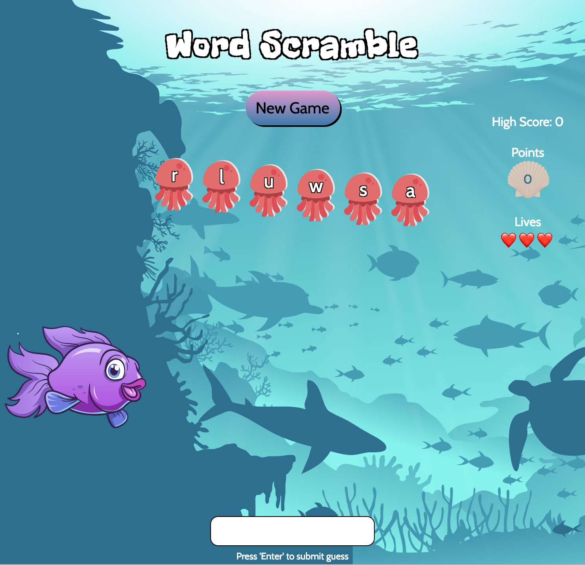

# Word Scramble

Word Scramble is a classic word game in which a player is given a set of scrambled letters that form a word. 

The object of the game is to unscramble the letters to create the word. 

If you are successful, your points will increase by the number of letters in each word you unscramble.

Designed to help with spelling, improve memory, and exercise problem-solving skills, Word Scramble can provide suitable entertainment for any age!

This version of the game is ocean themed. All of the words are related to aquatic life.

## Game Instructions

Click "New Game"

Jumbled letters will appear on the screen. You have unlimited time to guess the correct word, but you only have one chance to guess that particular word correctly. 

Once you think you know the word, type your guess in the input at the bottom of the screen.

You only have three lives. If you guess a wrong word, you lose a life. The score and number of lives remaining are located on the right side of the page.

The game ends when you guess three wrong words.

NOTE: you have to type your guess in all lowercase letters.

## Built With

* HTML
* CSS
* JavaScript
* Animations from <a href="https://popmotion.io/pure/">Popmotion Pure</a>
* Vectors from <a href="https://www.vecteezy.com/">Vecteezy.com</a>

## Authors

* Liz Davidson

##Acknowledgments

Remove event listeners - https://developer.mozilla.org/en-US/docs/Web/API/EventTarget/removeEventListener

adding animation to the jelly fish - source https://codepen.io/popmotion/pen/XzYJvP
